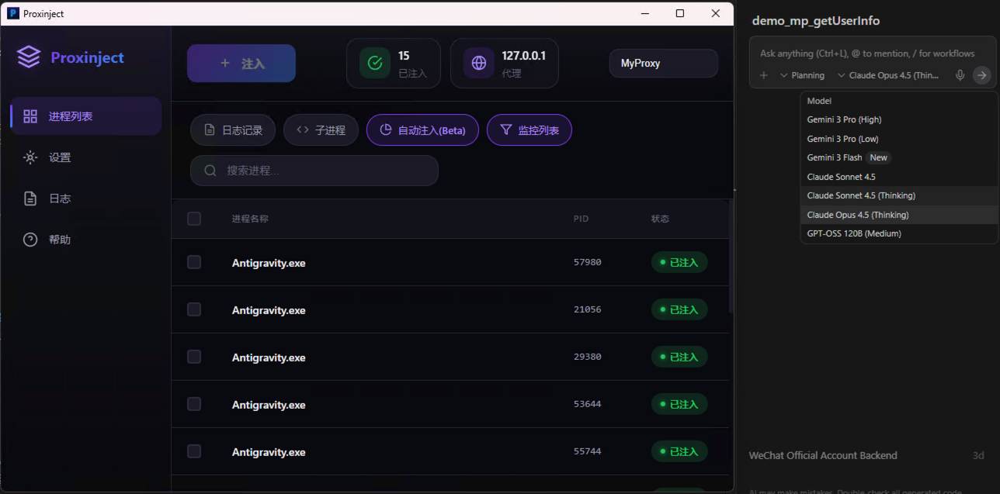
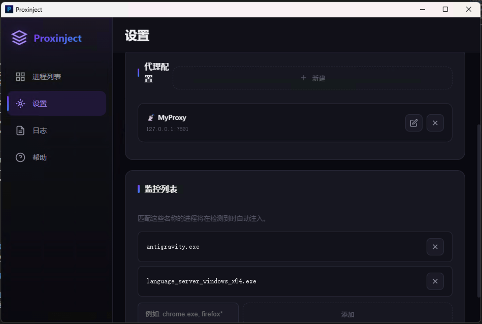
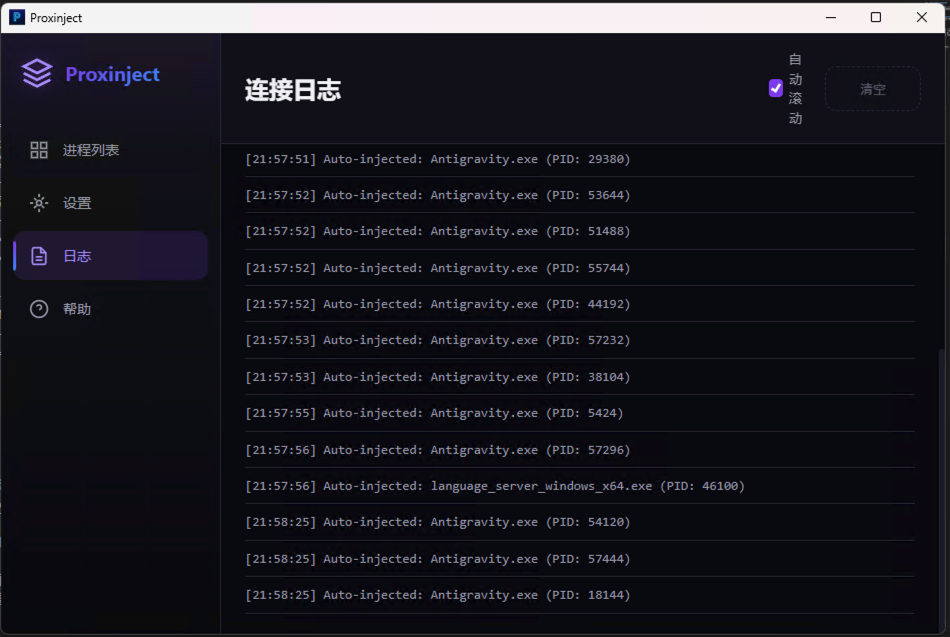
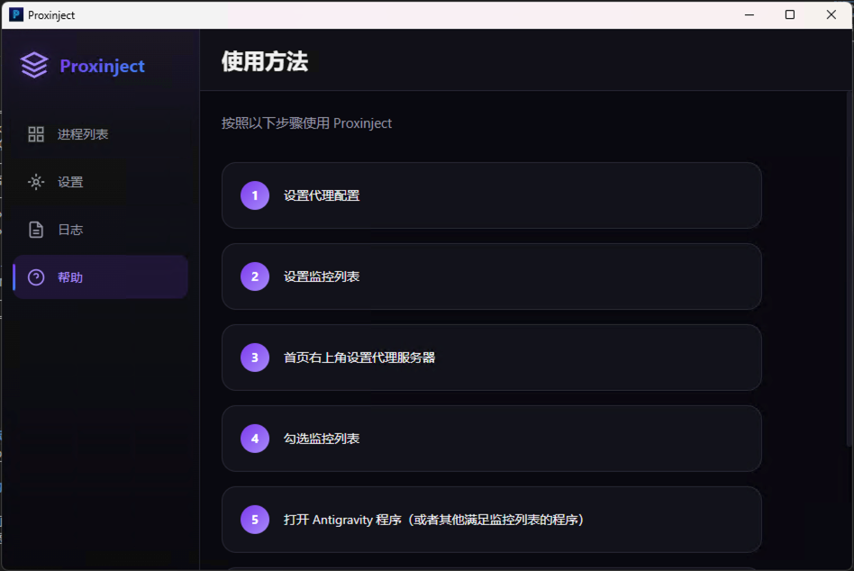

# Proxinject-Go

<p align="center">
  
</p>

<p align="center">
  <strong>一个 Windows 平台的 SOCKS5 代理注入工具</strong><br>
  选择目标进程，让它们通过代理服务器连接网络！
</p>

<p align="center">
  <a href="#功能特性">功能特性</a> •
  <a href="#截图展示">截图展示</a> •
  <a href="#安装">安装</a> •
  <a href="#构建说明">构建说明</a> •
  <a href="#使用方法">使用方法</a> •
  <a href="#致谢">致谢</a>
</p>

---

## 截图展示

<p align="center">
  
</p>

<p align="center">
  <em>主界面 - 进程列表与代理注入</em>
</p>

<table>
  <tr>
    <td align="center">
      
      <br><em>设置 - 代理配置与监控列表</em>
    </td>
    <td align="center">
      
      <br><em>日志 - 连接记录</em>
    </td>
  </tr>
  <tr>
    <td align="center" colspan="2">
      
      <br><em>帮助 - 使用指南</em>
    </td>
  </tr>
</table>

---

## 关于本项目

本项目是基于 [PragmaTwice/proxinject](https://github.com/PragmaTwice/proxinject) 的 Go + Wails v2 实现版本。原项目使用 C++ 和 Tauri 构建，本项目将前端保留为 Vue 3，后端改用 Go 语言通过 FFI 调用原项目编译的 DLL 来实现代理注入功能。

### 架构说明

```
proxinject-go/
├── frontend/              # Vue 3 + TypeScript 前端
├── resources/             # DLL 资源文件
│   ├── proxinject_ffi.dll    # 主 FFI 接口库
│   ├── proxinjectee.dll      # 64位注入模块
│   └── proxinjectee32.dll    # 32位注入模块
├── app.go                 # Wails 应用主逻辑
├── ffi.go                 # Go FFI 绑定
├── tray.go                # 系统托盘功能
└── main.go                # 程序入口
```

## 功能特性

- 🎯 **进程注入** - 选择任意 Windows 进程并注入 SOCKS5 代理
- 🔄 **自动注入** - 根据进程名模式自动注入新启动的进程
- 🌐 **代理管理** - 支持多个代理配置的保存和切换
- 📝 **连接日志** - 可选的网络连接日志记录
- 🔗 **子进程支持** - 自动注入被注入进程创建的子进程
- 🖥️ **系统托盘** - 最小化到托盘，后台运行
- 🌍 **多语言支持** - 中文 / English

## 安装

### 使用预编译版本

1. 从 [Releases](../../releases) 页面下载最新版本
2. 解压并运行 `Proxinject.exe`

### 从源码构建

请参阅下方的 [构建说明](#构建说明) 部分。

## DLL 编译与依赖

本项目依赖 [PragmaTwice/proxinject](https://github.com/PragmaTwice/proxinject) 项目编译的 DLL 文件来实现核心注入功能。

### 获取 DLL 文件

**方式一：从 proxinject Releases 下载**

1. 访问 [proxinject Releases](https://github.com/PragmaTwice/proxinject/releases)
2. 下载最新版本的 portable archive (.zip)
3. 解压后将以下 DLL 文件复制到 `resources/` 目录：
   - `proxinjectee.dll` (64位注入模块)
   - `proxinjectee32.dll` (32位注入模块)

**方式二：从源码编译 proxinject**

```powershell
# 确保已安装 MSVC 和 CMake
git clone https://github.com/PragmaTwice/proxinject.git
cd proxinject
./build.ps1 -mode Release -arch x64
```

编译完成后，从 `./release` 目录获取 DLL 文件。

### proxinject_ffi.dll

`proxinject_ffi.dll` 是本项目特有的 FFI 封装层，用于提供 Go 语言调用接口。该 DLL 导出以下函数：

| 函数名 | 说明 |
|--------|------|
| `proxinject_init` | 初始化注入器 |
| `proxinject_shutdown` | 关闭注入器 |
| `proxinject_inject` | 注入指定 PID 的进程 |
| `proxinject_set_proxy` | 设置代理服务器地址 |
| `proxinject_clear_proxy` | 清除代理设置 |
| `proxinject_enable_log` | 启用/禁用日志 |
| `proxinject_enable_subprocess` | 启用/禁用子进程注入 |
| `proxinject_list_processes` | 获取进程列表 |
| `proxinject_get_injected_count` | 获取已注入进程数量 |

## 构建说明

### 环境要求

- **Go** 1.18 或更高版本
- **Node.js** 16 或更高版本
- **Wails** v2 CLI
- **Windows SDK**

### 安装 Wails

```bash
go install github.com/wailsapp/wails/v2/cmd/wails@latest
```

### 构建步骤

1. **克隆项目**
   ```bash
   git clone https://github.com/your-repo/proxinject-go.git
   cd proxinject-go
   ```

2. **确保 DLL 文件就位**
   
   确保 `resources/` 目录下包含所需的 DLL 文件：
   - `proxinject_ffi.dll`
   - `proxinjectee.dll`
   - `proxinjectee32.dll`

3. **安装前端依赖**
   ```bash
   cd frontend
   npm install
   cd ..
   ```

4. **开发模式运行**
   ```bash
   wails dev
   ```

5. **生产构建**
   ```bash
   wails build
   ```
   
   构建产物位于 `build/bin/` 目录。

### 创建安装包

项目支持通过 WiX Toolset 创建 MSI 安装包。构建完成后，安装包将包含所有必需的 DLL 文件。

## 使用方法

### 基本操作

1. **启动程序** - 运行 `Proxinject.exe`，程序需要管理员权限
2. **配置代理** - 点击设置按钮，添加 SOCKS5 代理服务器地址和端口
3. **选择进程** - 在进程列表中找到并选择目标进程
4. **注入代理** - 点击注入按钮，选中的进程将通过代理连接网络

### 自动注入

1. 在搜索框输入进程名匹配模式（如 `chrome`、`firefox`）
2. 开启自动注入开关
3. 新启动的匹配进程将自动被注入代理

### 系统托盘

- 点击窗口关闭按钮会最小化到系统托盘
- 右键托盘图标可以显示窗口或退出程序

## 技术细节

### 注入原理

本项目通过 DLL 注入技术，将代理处理模块注入到目标进程中。注入的 DLL 会 hook Windows 的 socket 相关 API (如 `connect`, `WSAConnect`)，将网络连接重定向到 SOCKS5 代理服务器。

核心依赖：
- **[minhook](https://github.com/TsudaKageyu/minhook)** - 轻量级 Windows API hook 库
- **ASIO** - 异步网络通信
- **protopuf** - 进程间通信协议

### 安全提示

⚠️ **注意**：代理注入功能需要管理员权限，某些安全软件可能会将其识别为可疑行为。请确保只对信任的进程使用本工具。

## 致谢

- **[PragmaTwice/proxinject](https://github.com/PragmaTwice/proxinject)** - 原版 C++ 实现，提供了核心的代理注入功能
- **[Wails](https://wails.io/)** - 用于构建跨平台桌面应用的 Go 框架
- **[Vue 3](https://vuejs.org/)** - 前端框架
- **[minhook](https://github.com/TsudaKageyu/minhook)** - API hook 库

## 许可证

本项目基于 MIT 许可证开源。

---

<p align="center">
  Made with ❤️ using Go + Wails + Vue
</p>
